# MediFlow - Sistema de Gestão de Clínicas

MediFlow é uma aplicação web completa, desenvolvida em **Go** com o framework **Gin**, para a gestão de clínicas de terapia. O sistema foi projetado com uma arquitetura robusta, focada em segurança, rastreabilidade e separação de responsabilidades entre diferentes perfis de usuários.

## ✨ Funcionalidades Principais

O sistema é dividido em painéis seguros e independentes para cada perfil de usuário, além de um portal exclusivo para pacientes.

### 🧠 Assistente de IA (Gemini / Ollama)

MediFlow integra IA generativa para atuar como uma poderosa ferramenta de apoio para terapeutas e administradores.

* **Resumos Sob Demanda:** Com um único clique na página de prontuário do paciente, o profissional pode gerar um resumo conciso e estruturado de todo o histórico de sessões.
* **Foco em Insights, Não em Diagnósticos:** A IA é rigorosamente instruída para identificar padrões, evoluções emocionais e temas recorrentes, **sem nunca fornecer diagnósticos ou sugerir tratamentos**, garantindo um uso ético e seguro da tecnologia.
* **Arquitetura Flexível:** O sistema possui uma arquitetura "plugável" que permite escolher seu provedor de IA através do arquivo de configuração `.env`:
    * **Gemini:** Utilize os poderosos modelos do Google na nuvem.
    * **Ollama:** Execute modelos de código aberto (como Llama 3, Mistral) localmente para máxima privacidade e sem custos de API.

### 🔐 Segurança e Acesso

* **Controle de Acesso por Perfil:** O sistema possui 3 níveis de acesso (Administrador, Secretária, Terapeuta), cada um com suas permissões estritamente controladas por middleware.
* **"Soft Deletes" (Exclusão Lógica):** Nenhum usuário ou paciente é permanentemente apagado do banco de dados. Em vez disso, são marcados como "inativos", preservando 100% do histórico e das relações de dados.
* **Logs de Auditoria:** Todas as ações críticas (logins, criação de prontuários, pagamentos, etc.) são registradas em uma tabela de auditoria, garantindo total rastreabilidade.

### 👤 Portal do Paciente

* **Acesso Seguro por Token:** Pacientes não precisam de senha. Eles recebem um link único e seguro para acessar um portal exclusivo.
* **Consentimento Online:** O paciente pode ler e fornecer o Termo de Consentimento diretamente pelo portal, incluindo a validação completa de CPF.

### 👩‍💼 Painel da Secretária

* **Foco na Agilidade:** Desenhado para as tarefas administrativas do dia a dia.
* **Cadastro Rápido de Pacientes:** Registra apenas as informações de contato essenciais para gerar o link do portal.
* **Gestão da Agenda e Financeira:** Visualização da agenda, agendamentos e controle de pagamentos.

### 👨‍⚕️ Painel do Terapeuta

* **Foco Clínico e Privacidade:** O terapeuta tem acesso apenas aos seus próprios dados e pacientes.
* **Dashboard Personalizado:** Visualiza sua agenda e uma lista de seus pacientes.
* **Acesso Seguro ao Prontuário:** Pode acessar o prontuário completo de seus pacientes para visualizar o histórico e adicionar novas anotações.

### 👑 Painel do Administrador

* **Controle Total:** Visão e controle completos sobre todos os aspectos do sistema.
* **Gestão de Usuários e Pacientes:** CRUD (Criar, Ler, Atualizar, Desativar) completo para todos os usuários e pacientes.
* **Dashboard de Monitoramento:** Painel com KPIs (Indicadores-Chave de Desempenho) operacionais e financeiros.
* **Visualização de Logs:** Acesso à tela de auditoria para monitorar todas as ações realizadas no sistema.

## 🚀 Como Executar o Projeto

### Pré-requisitos

* **Go:** Versão 1.18 ou superior.
* **PostgreSQL:** Uma instância do PostgreSQL ativa.
* **(Opcional) Ollama:** Necessário se desejar usar modelos de IA localmente.

### 1. Configuração do Ambiente

Clone o repositório e navegue para a pasta raiz do projeto. Crie um arquivo chamado `.env` e preencha com suas credenciais. Abaixo está um exemplo completo:

```env
# Configurações do Banco de Dados
DB_TYPE=postgres
DB_HOST=localhost
DB_PORT=5432
DB_USER=seu_usuario_aqui
DB_PASS=sua_senha_aqui
DB_NAME=mediflow
PORT=8080

# --- Configurações da IA ---
# Escolha o provedor: "gemini" ou "ollama". Deixe em branco para desativar.
AI_PROVIDER="ollama"

# Para Gemini
GEMINI_API_KEY="SUA_CHAVE_API_DO_GOOGLE_AI_STUDIO_AQUI"
GEMINI_MODEL="gemini-1.5-flash-latest"

# Para Ollama (local)
OLLAMA_API_URL="http://localhost:11434/api/generate"
OLLAMA_MODEL="llama3"
````

### 2\. Instalação das Dependências

Execute o comando abaixo para baixar todas as dependências, incluindo as da IA:

```sh
go mod tidy
```

### 3\. Configuração do Banco de Dados

O projeto inclui um gestor de banco de dados (`data_manager.go`) para facilitar a configuração inicial.

**a. Crie o banco de dados** no PostgreSQL com o nome que especificou no `.env`.

**b. Inicialize as tabelas:**

```sh
go run data_manager.go -init
```

**c. Crie os usuários padrão:**

```sh
go run data_manager.go -create-users
```

**d. (Opcional) Popule com dados de teste realistas:**

```sh
go run data_manager.go -populate
```

### 4\. Executar a Aplicação

Inicie o servidor web:

```sh
go run main.go
```

A aplicação estará acessível em `http://localhost:8080`.

## 🔑 Credenciais de Acesso Padrão

  * **Admin:** `admin@mediflow.com` / `senha123`
  * **Secretária:** `secretaria@mediflow.com` / `senha123`
  * **Terapeuta:** `terapeuta@mediflow.com` / `senha123`

## Fotos

<!-- Tabela para exibir as screenshots do fluxo de teste em uma grade -->
<table align="center">
    <!-- Linha 1 -->
    <tr>
        <td align="center">
            <p><strong>01. Dashboard Inicial</strong></p>
            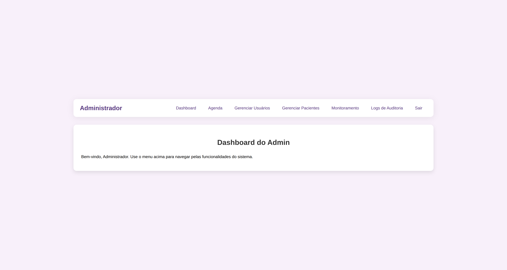
        </td>
        <td align="center">
            <p><strong>02. Agenda</strong></p>
            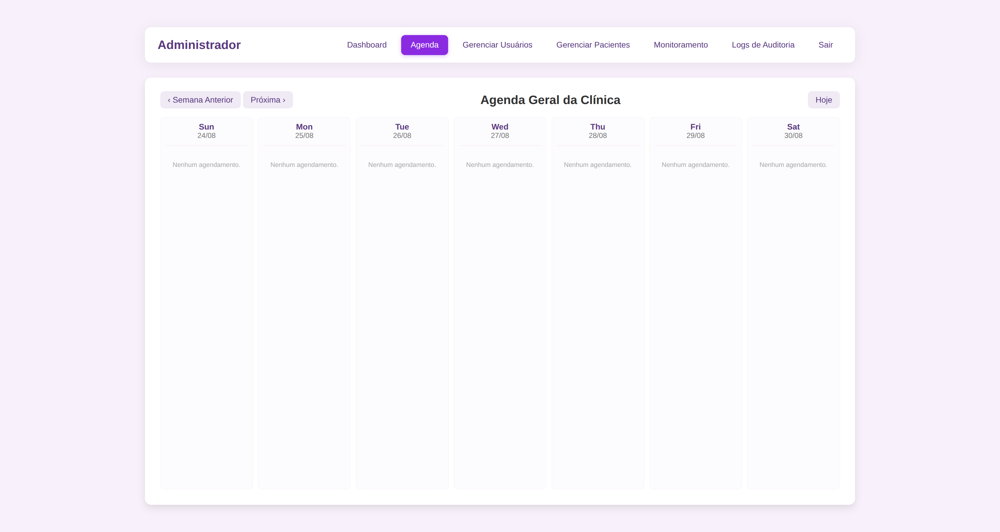
        </td>
    </tr>
    <!-- Linha 2 -->
    <tr>
        <td align="center">
            <p><strong>03. Gerenciar Usuários</strong></p>
            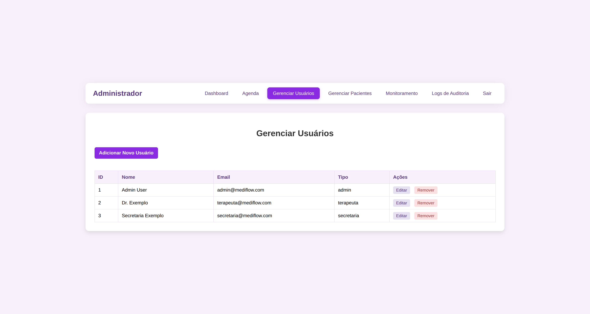
        </td>
        <td align="center">
            <p><strong>04. Gerenciar Pacientes</strong></p>
            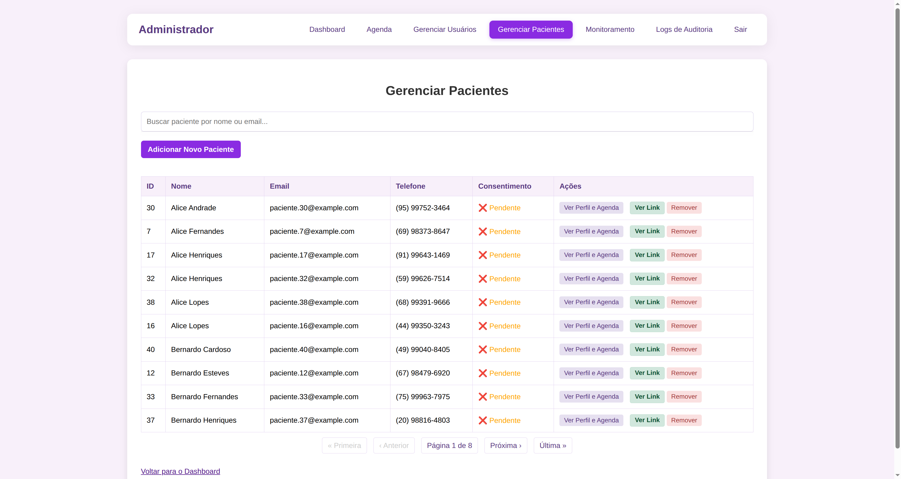
        </td>
    </tr>
    <!-- Linha 3 -->
    <tr>
        <td align="center">
            <p><strong>05. Monitoramento</strong></p>
            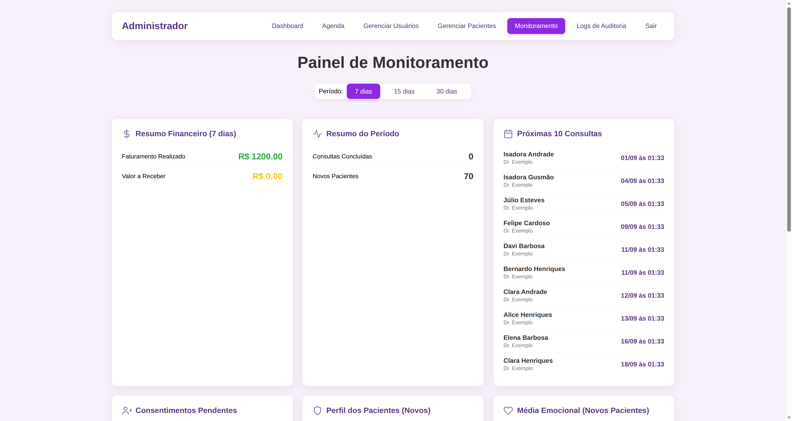
        </td>
        <td align="center">
            <p><strong>06. Logs de Auditoria</strong></p>
            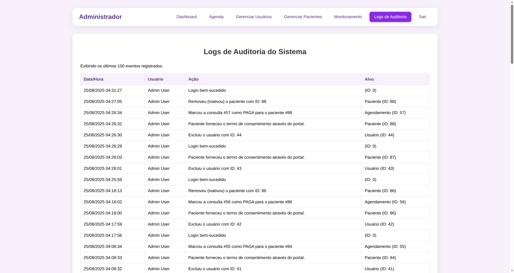
        </td>
    </tr>
    <!-- Linha 4 -->
    <tr>
        <td align="center">
            <p><strong>07. Formulário Novo Usuário</strong></p>
            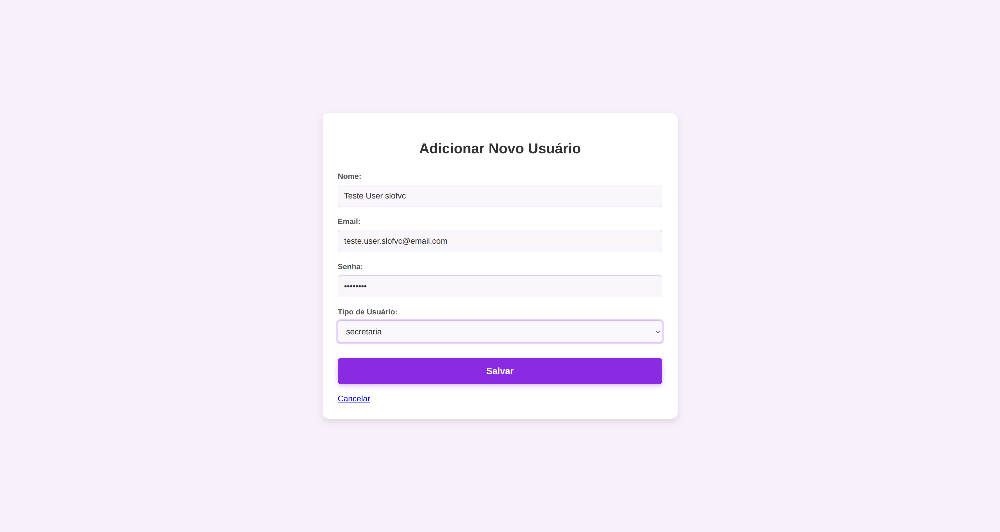
        </td>
        <td align="center">
            <p><strong>08. Lista com Novo Usuário</strong></p>
            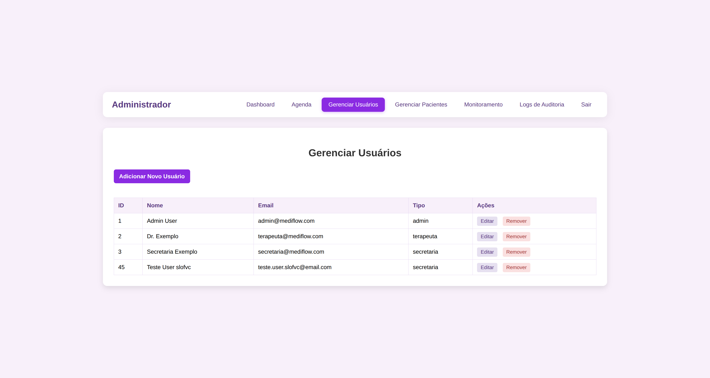
        </td>
    </tr>
    <!-- Linha 5 -->
    <tr>
        <td align="center">
            <p><strong>09. Lista Após Remoção</strong></p>
            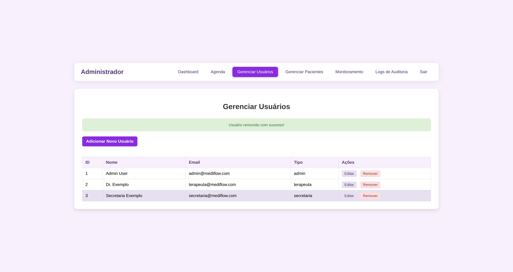
        </td>
        <td align="center">
            <p><strong>10. Formulário Novo Paciente</strong></p>
            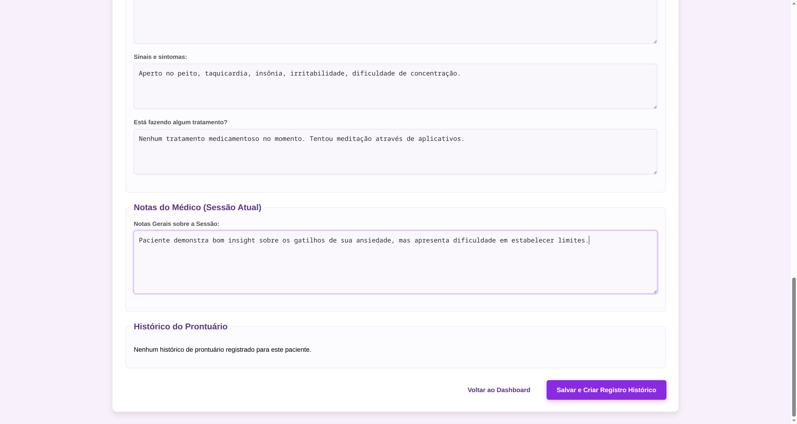
        </td>
    </tr>
    <!-- Linha 6 -->
    <tr>
        <td align="center">
            <p><strong>11. Formulário Consentimento</strong></p>
            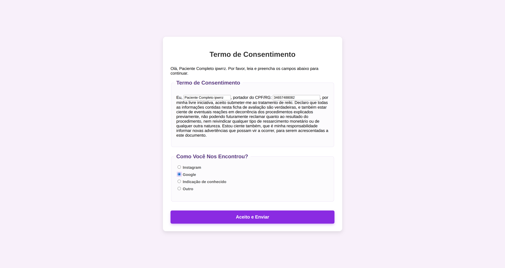
        </td>
        <td align="center">
            <p><strong>12. Página de Sucesso</strong></p>
            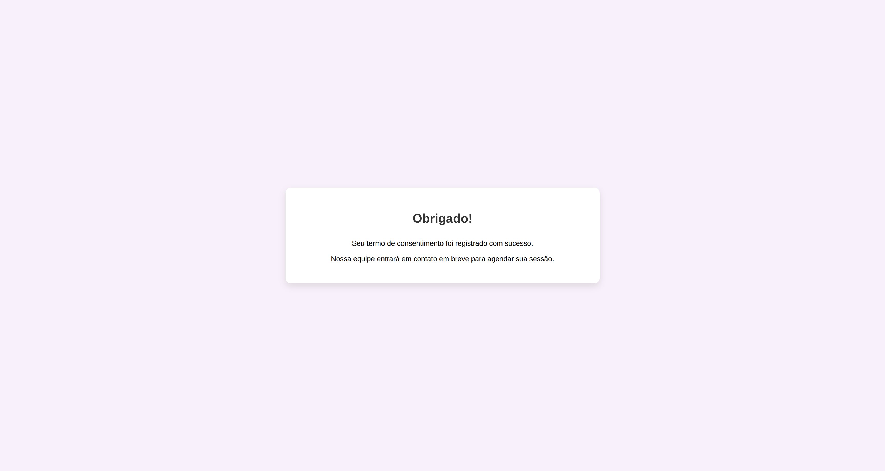
        </td>
    </tr>
    <!-- Linha 7 -->
    <tr>
        <td align="center">
            <p><strong>13. Status do Consentimento Atualizado</strong></p>
            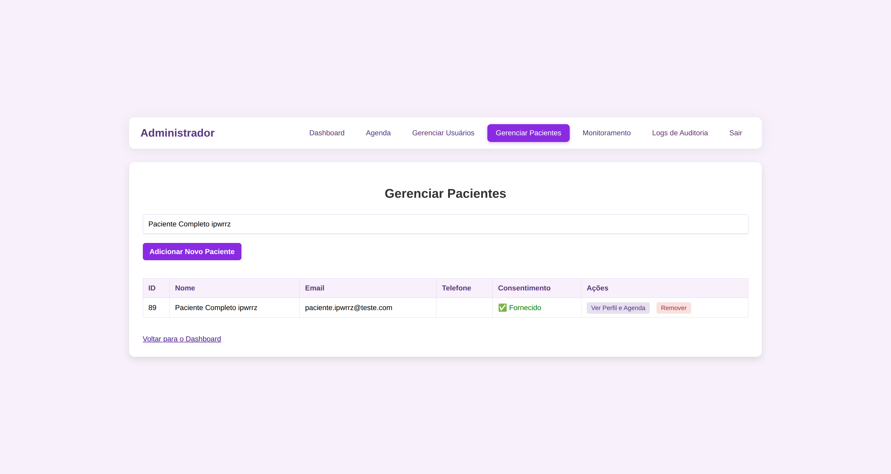
        </td>
        <td align="center">
            <p><strong>14. Perfil para Agendamento</strong></p>
            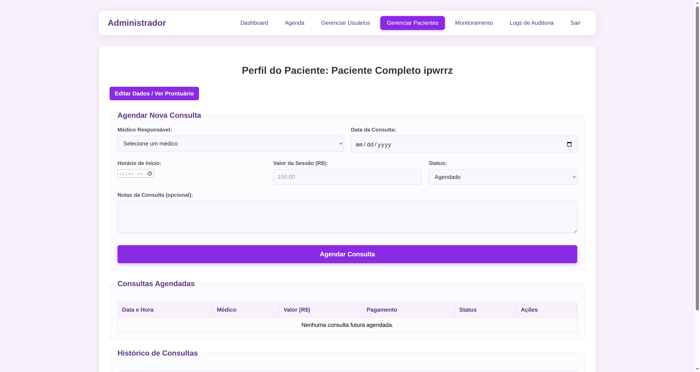
        </td>
    </tr>
    <!-- Linha 8 -->
    <tr>
        <td align="center">
            <p><strong>15. Formulário de Agendamento</strong></p>
            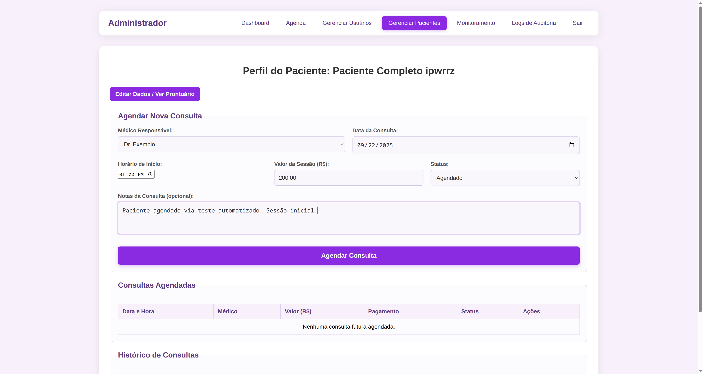
        </td>
        <td align="center">
            <p><strong>16. Consulta Agendada</strong></p>
            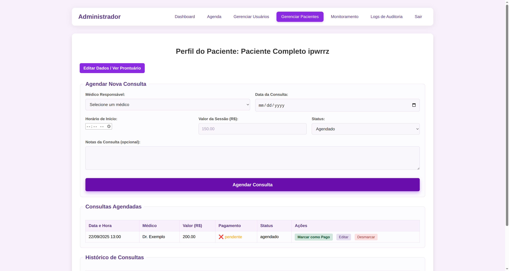
        </td>
    </tr>
    <!-- Linha 9 -->
    <tr>
        <td align="center">
            <p><strong>17. Consulta Marcada como Paga</strong></p>
            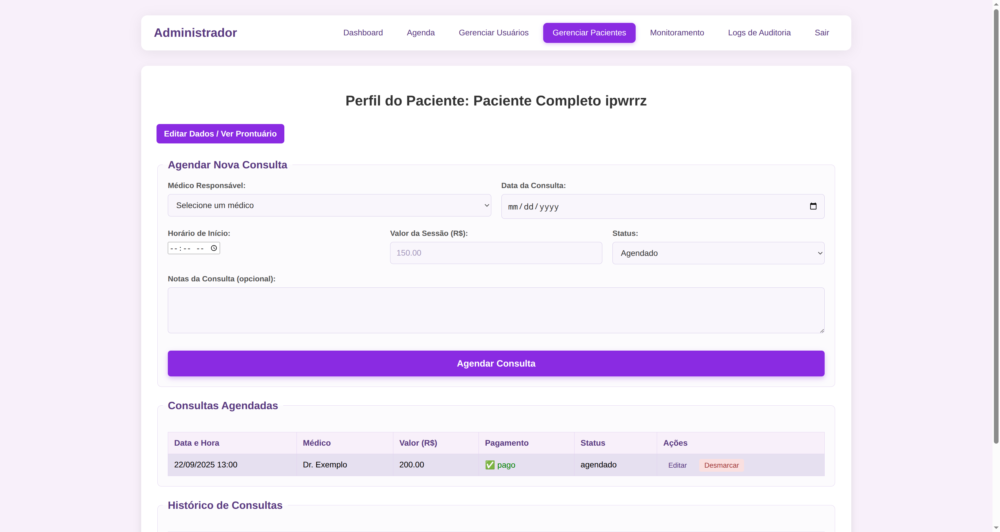
        </td>
        <td align="center">
            <p><strong>18. Resumo da IA Gerado</strong></p>
            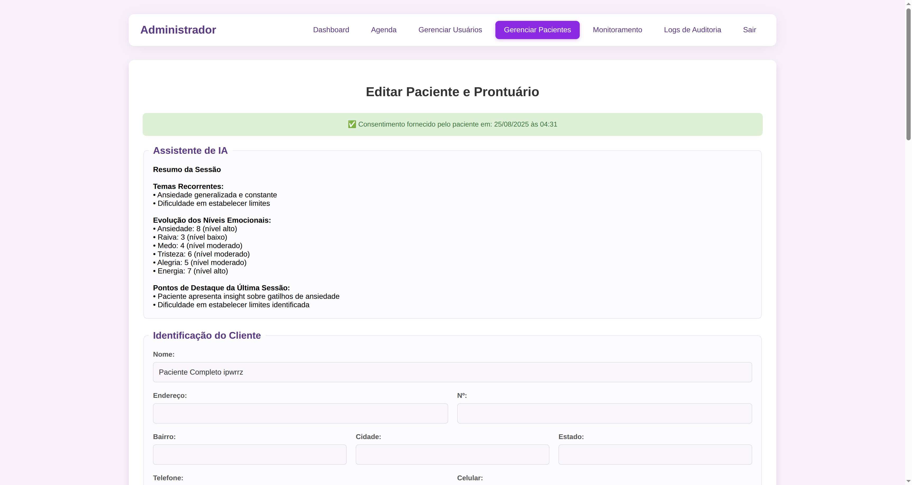
        </td>
    </tr>
    <!-- Linha 10 (centralizada) -->
    <tr>
        <td align="center" colspan="2">
            <p><strong>19. Logout Final</strong></p>
            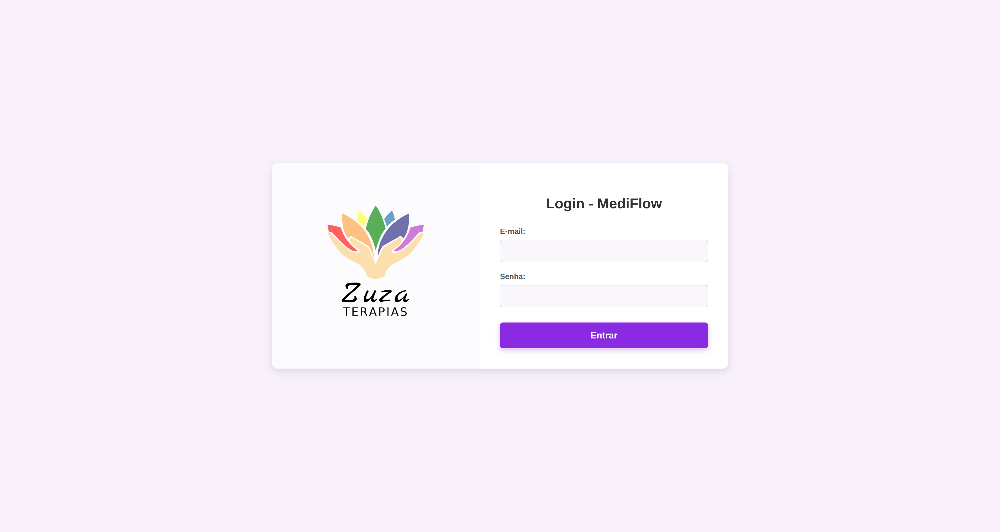
        </td>
    </tr>
</table>
